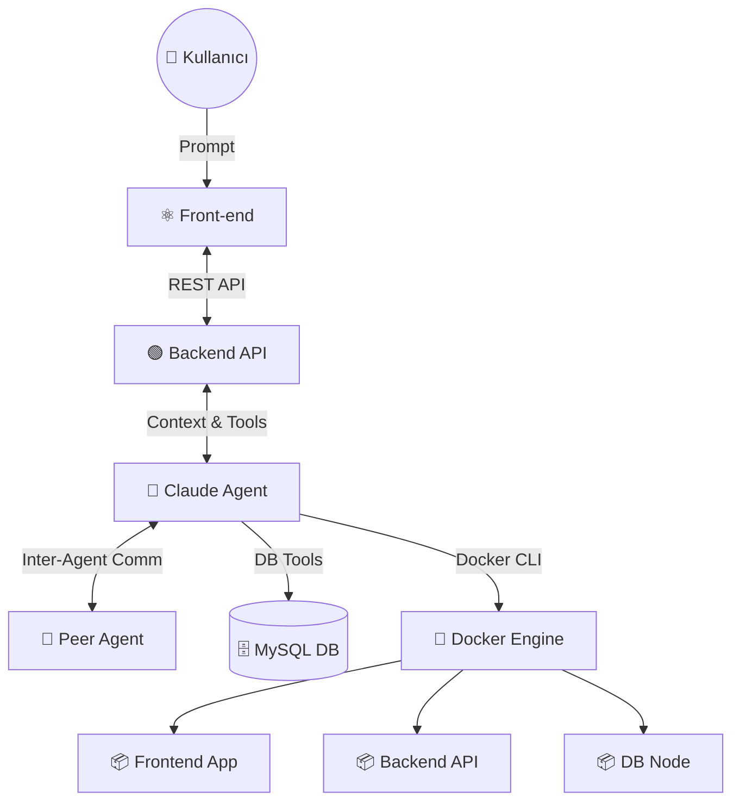

# 🤖 PM-AI-Agent (Project Management AI Agent)

Tam teşekküllü (Full-stack) proje yönetim uygulaması. Claude AI destekli asistan(lar) sayesinde doğal dil komutlarıyla proje yönetebilir, Docker servislerinizi kontrol edebilir, MySQL veritabanları oluşturabilir ve yazılım projelerinizin kaynak kodlarını otomatik olarak oluşturabilirsiniz.

## 🌟 Öne Çıkan Özellikler

- **Çoklu Agent Mimarisi (Multi-Agent System):** Kararların ve süreçlerin tek bir yapıda tıkanmaması için birbiriyle iletişim kuran farklı agent'lar.
- **Docker Yönetimi:** Konteyner oluşturma, yönetme ve log takibi.
- **Veritabanı Yönetimi:** MySQL/SQLite destekli tam DB yönetimi (Şema oluşturma, tablo kurgulama).
- **Proje & Görev Yönetimi:** Kanban tahtası ve görev delegasyonu.

---

## 🏗️ Sistem Mimarisi ve Agent'lar Arası İlişki

PM-AI-Agent, klasik istemci-sunucu modelinin ötesine geçerek **Agent Tabanlı Mimari (Agent-Based Architecture)** kullanır. Bu sistemde her bir katman sadece veri iletmekle kalmaz, asıl kararları veren yapay zeka birimleriyle (Claude Agent ve Peer Agent) akışkan ve sürekli bir iletişim halindedir.

### 🔄 Etkileşim Akışı (Front-end ↔ Backend ↔ Agent'lar ↔ DB/Docker)

Kullanıcının sisteme girdiği her bir komut, aşağıdaki bileşenler ve agent'lar arasında işlenir ve sonuca bağlanır:

1. **👤 Kullanıcı (User):** Süreci başlatan kişi. İsteğini doğal dille yazar (Örn: "Bana bir React projesi oluştur ve veritabanı bağlayıp docker'da çalıştır").
2. **⚛️ Front-end (React UI):** 
   - İletişimin başladığı ilk kontrol noktasıdır.
   - Sadece bir arayüz (UI) olmakla kalmaz, anlık olarak sistemin hangi parçasının çalıştığını (Agent yetkilerini, Docker işlemlerini, DB sorgularını) analiz edip `React Flow` şeması üzerinde canlı olarak görselleştirir.
3. **🟢 Backend (Node.js API):**
   - Sistemin sinir merkezidir. Front-end'den gelen istekleri alır, durumu değerlendirir ve asıl görevi yapay zeka modeline (Claude) aktarır.
   - Yapay zekanın sürekliliğini sağlayan "Düşünme Döngüsünü" (Agentic Loop) barındırır.
4. **🤖 Claude Agent (Ana Yapay Zeka):**
   - Sistemin ana karar verici beyni. Gelen isteği anlar ve **hangi araçları (Tools)** kullanması gerektiğine karar verir.
   - Terminalde kod çalıştırabilir, sunucuyu okuyabilir, sıfırdan sistem inşa edebilir.
5. **🤖 Peer Agent (Yardımcı/Eş Yapay Zeka):**
   - Claude Agent'ın bir nevi "pair programming" arkadaşıdır. Daha karmaşık görevlerde görev paylaşımı için ana yapay zeka tarafından tetiklenir.
   - Claude Agent ile **çift yönlü haberleşerek (inter-agent msg)**, problemleri çok daha hızlı çözer ve asıl çıktıların kalitesini devasa ölçüde artırır.
6. **🗄️ MySQL DB & 🐳 Docker Daemon (Servis Katmanı):**
   - **Agent ↔ DB İlişkisi:** Backend üzerinden gelen yapay zeka komutları, doğrudan MySQL üzerinde veritabanı ve tablolar oluşturur. Agent, yazdığı SQL komutunun sonucunu anında okur ve bir sonraki kararı ("Eğer tablo oluştuysa kodu yazmaya başlayabilirim") buna göre verir.
   - **Agent ↔ Docker İlişkisi:** Yapay zeka, doğrudan host sistemdeki Docker API'si (veya CLI) ile iletişime geçer. Bir konteyner patlarsa yapay zeka logları okur, hatayı tespit edip kodda düzeltme yapar ve konteyneri kendi kendine yeniden başlatabilir (Self-healing).

**Bileşen İlişki Haritası:**


Bu otonom sistem sayesinde örneğin oluşturulan bir sistem çalışmazsa, **Backend**, **Claude Agent**'a "Hata aldık: log şu" şeklinde veri döndürür, **Claude Agent** durumu **Peer Agent** ile devingen şekilde değerlendirip kodu düzeltir ve tekrar işler. Tüm bu macera, kullanıcıya baştan sona **Front-end** diyagramında animasyonlu olarak yansıtılır.

---

## 🚀 Hızlı Başlangıç

### Gereksinimler
- Node.js 18+
- MySQL (Örn: Laragon, XAMPP veya Docker)
- Docker Desktop

### 1️⃣ Kurulum (Lokal Geliştirme)

```bash
# İlk olarak hem backend hem frontend klasörlerindeki kütüphaneleri indirelim
npm run install:all

# Çevresel değişken dosyanızı kopyalayın
cp .env.example .env
```
`.env` dosyasındaki ayarlarınız şu şekilde görünmelidir. Burada en önemlisi `ANTHROPIC_API_KEY`:
```env
ANTHROPIC_API_KEY=sk-ant-...

MYSQL_HOST=localhost
MYSQL_PORT=3306
MYSQL_USER=root
MYSQL_PASSWORD=your_password
MYSQL_DATABASE=aiagent_db

USE_SQLITE=false       # Eğer bilgisayarınızda MySQL yüklü değilse bunu true yapın
PORT=5000
```

### 2️⃣ Çalıştırma

Tüm uygulamayı aynı terminalden eşzamanlı olarak başlatmak için:
```bash
npm run dev
```

| Arabirim | URL | Açıklama |
|---|---|---|
| **Front-end UI** | `http://localhost:3000` | Kullanıcı arayüzü ve yapay zeka ile etkileşim köşesi |
| **Backend API** | `http://localhost:5000` | Agent karar mekanizması ve servis endpointleri |

---

## 🐳 Docker ile Tam İzolasyonlu Çalıştırma

Kendi bilgisayarınızda Node veya veritabanı yığını olmasını istemiyorsanız, tüm projeyi sadece Docker içinden izole olarak başlatabilirsiniz:

```bash
npm run docker        # Projeyi docker compose ile build eder ve arka planda başlatır
npm run stop          # Konteynerleri güvenle durdurur
npm run clean         # Konteynerleri bitirir ve içindeki tüm uygulama (volume) verilerini temizler
```

---

## 🛠 Neler Yapabilirsiniz? (Örnek Kullanımlar)

Sisteme bağlandıktan sonra sohbet kısmından yapay zekaya şu direktifleri verebilirsiniz:

- **Sıfırdan Proje Yaratma:** "C:/Projeler klasörüne benim için bir Next.js e-ticaret uygulaması oluştur, backend'i nodejs olsun. Kullanıcı tablolarını oluştur."
- **Sistem Okuma & Debug:** "Docker üzerindeki frontend servisimin loglarında ne hata var? Kontrol edip kodları düzelt."
- **DB Manipülasyonu:** "Sistemde yeni bir aiagent_yedek veritabanı kur ve içine test adlı bir tablo ekle."
- **Uygulama İçi PM:** "Görevler panosundan 'Tasarım eksiklerini tamamla' görevini kapat ve bana haftalık proje raporu çıkar."

---

## ⚙️ Uygulama Dizin Yapısı ve Detayları

```text
aiagent/
├── .env                          # Şifreler ve ortam çevre değişkenleri
├── docker-compose.yml            # Frontend, Backend, PMADmin, DB servis deklarasyonları
├── package.json                  # Projenin geneli için scriptler
│
├── backend/
│   ├── system-prompt.md          # Yapay zekanın "Şahsiyeti" (Arayüzden güncellenebilir)
│   └── src/
│       ├── agent.js              # 🤖 Agentic Loop: Ana yapay zeka beyin döngüsü (Tool'ları burada kullanır)
│       ├── tools.js              # Proje/Görev PM sistem fonksiyonları
│       ├── docker-tools.js       # Docker iletişimini sağlayan JS modülü
│       ├── fs-tools.js           # Sistemde dosya yaratma ve konsola komut gönderme
│       ├── mysql-admin-tools.js  # Kullanıcının MySQL sunucusunda DB var etmesi için
│       └── db.js                 # Uygulamanın kendi MySQL veya SQLite veri bağlantısı
│
└── frontend/
    └── src/
        ├── App.jsx               # Ana Uygulama bileşeni ve Animasyon sıraları
        └── components/
            ├── AgentFlowCanvas.jsx  # Bileşenler arası iletişimin oklarla görüldüğü harita
            ├── ChatPanel.jsx        # Kullanıcının yapay zeka ile konuştuğu panel
            └── ProjectsSidebar.jsx  # Tüm projeler, servislerin listelendiği Sidebar
```
